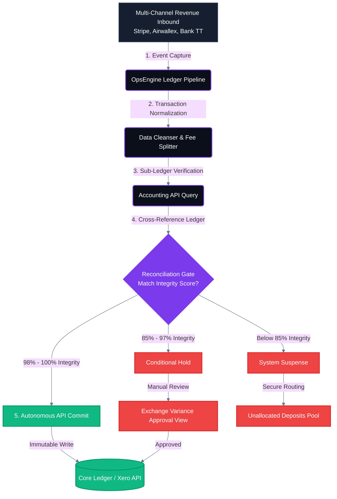

# System architecture diagram mapping the 5-stage automated ledger lifecycle from payment gateway webhooks to atomic double-entry API execution in Xero

```mermaid
---
config:
  theme: base
---
%%{init: {
  'theme': 'base',
  'themeVariables': {
    'lineColor': '#64748B'
  }
}}%%
graph TD
    %% Define Styles
    classDef source fill:#161F30,stroke:#24324D,stroke-width:2px,color:#fff;
    classDef process fill:#0B0F19,stroke:#7C3AED,stroke-width:2px,color:#fff;
    classDef gate fill:#7C3AED,stroke:#7C3AED,stroke-width:2px,color:#fff;
    classDef success fill:#10B981,stroke:#059669,stroke-width:2px,color:#fff;
    classDef fail fill:#EF4444,stroke:#DC2626,stroke-width:2px,color:#fff;

    %% Elements
    A[Multi-Channel Revenue Inbound<br>Stripe, Airwallex, Bank TT] -->|"1. Event Capture"| B(OpsEngine Ledger Pipeline)
    B -->|"2. Transaction Normalization"| C(Data Cleanser & Fee Splitter)
    C -->|"3. Sub-Ledger Verification"| D(Accounting API Query)
    D -->|"4. Cross-Reference Ledger"| E{Reconciliation Gate<br>Match Integrity Score?}
    
    %% Split Paths
    E -->|"98% - 100% Integrity"| F[5. Autonomous API Commit]
    E -->|"85% - 97% Integrity"| G[Conditional Hold]
    E -->|"Below 85% Integrity"| H[System Suspense]

    %% Final Destinations
    F -->|Immutable Write| I[(Core Ledger / Xero API)]
    G -->|Manual Review| J[Exchange Variance Approval View]
    H -->|Secure Routing| K[Unallocated Deposits Pool]
    J -->|Approved| I

    %% Apply Styles
    class A source;
    class B,C,D process;
    class E gate;
    class F,I success;
    class G,J fail;
    class H,K fail;
```
