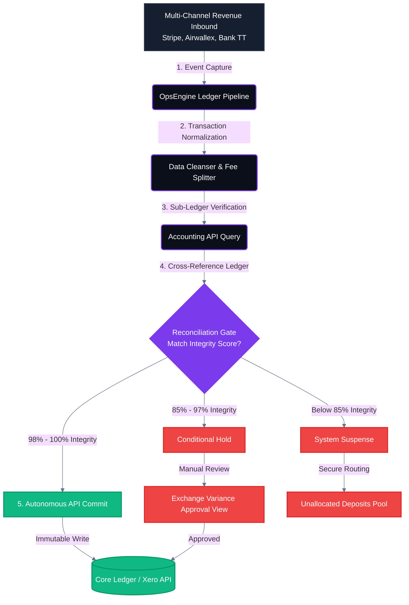

# Deterministic Ledger Automation & Reconciliation Pipeline

This schema tracks the event-driven capture, transaction normalization, and multi-tiered reconciliation engine of a high-volume multi-channel revenue stack. It outlines the structural distribution of ledger inputs across rigid data integrity score gates before committing state changes to core production accounting APIs.
 - **Architectural Target**: Eradicating unallocated cash anomalies and manual balance matching loops.
 - **Key Controls**: Dynamic exchange variance holding layers and absolute system suspense isolation pools for transactions showing sub-optimal structural match integrity.

