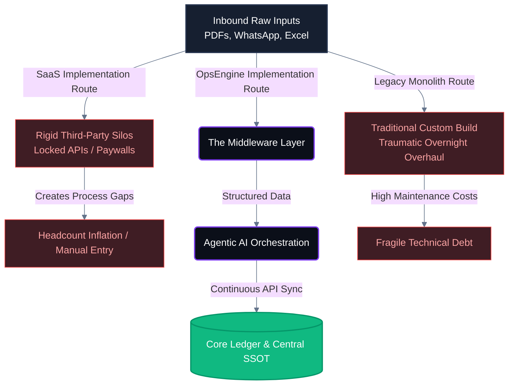

# Comparative System Topologies: The Architectural Delta

A comparative macro-blueprint highlighting the operational consequences of traditional technical implementations against a unified middleware configuration layer. It traces raw back-office inputs across legacy monolith builds, third-party SaaS silos, and custom orchestration pipelines to expose technical debt versus central system visibility.
 - **Architectural Target**: Highlighting the mechanical difference between fragile software investments and scalable operational infrastructure assets.
 - **Key Controls**: Isolating data ingestion layers from fragmented point-solutions to sustain a persistent, automated Single Source of Truth (SSOT).

