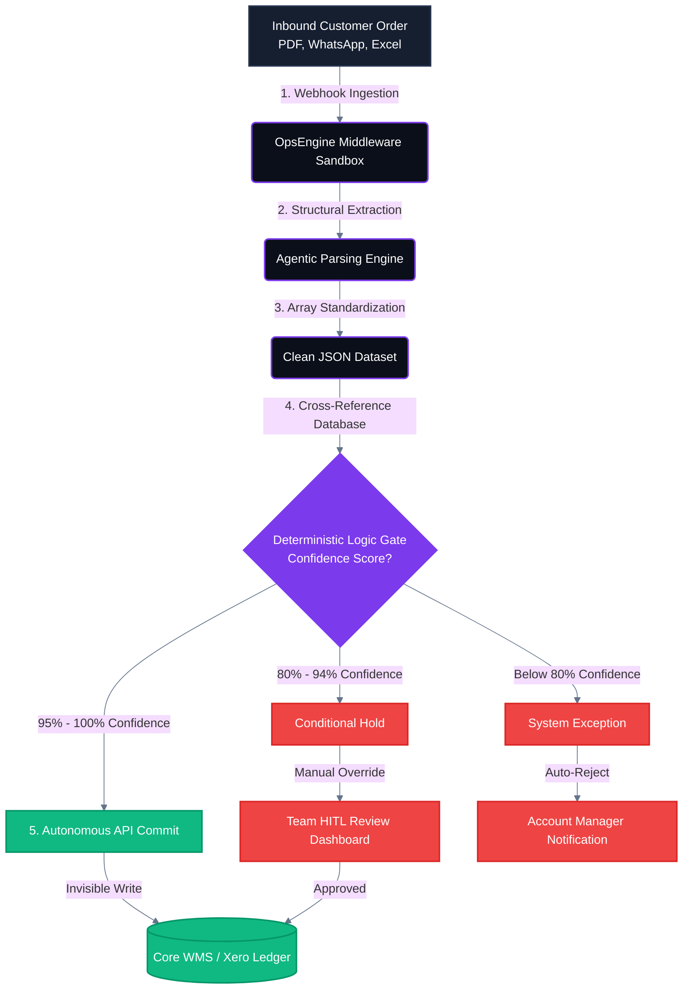

# Zero-Variance Order Ingestion & System Mapping Blueprint
This file diagrams the asynchronous webhook ingestion process engineered to normalize unstructured customer order payloads (PDFs, legacy sheets, digital text fields) into standardized transaction structures. It isolates ordering mechanics across strict verification filters to enforce system governance rules before pushing mutations to live WMS/ERP endpoints.

 - **Architectural Target**: Shifting order ingestion away from manual human monitoring loops into automated processing pathways.
 - **Key Controls**: Algorithmic parameter matching blocks backed by automated account management rejection notifications and multi-channel data-cleansing sanboxes.

